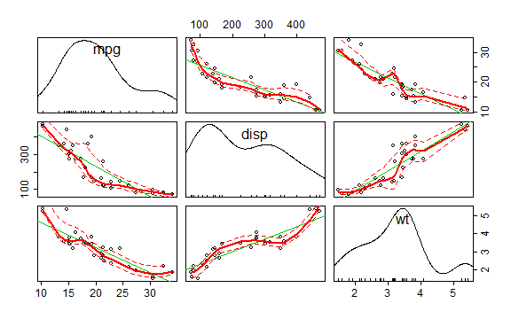

<style>
.reveal h1 {
    font-size: 2em;
    color: #fff7e6;
    text-align: left;
    padding-bottom: 10px;
    font-family: Impact, sans-serif;
}

.reveal h2 {
    font-size: 1.5em;
    color: #fff7e6;
    text-align: left;
    padding-bottom: 10px;
    font-family: Impact, sans-serif;
}

.reveal p {
    font-size: 0.75em;
    color: #fff7e6;
    text-align: left;
    padding-bottom: 10px;
    font-family: Verdana, sans-serif;
}


</style>


# Developing Data Products
## Course Project
-------------------------------------

Select the best car for your trip App


Rafael Encinas

---

## Introduction

This presentation is part of the Course Project for the Coursera Developing Data Products class. The peer assessed assignment has two parts. First, we need to create a Shiny application and deploy it on Rstudio's servers. Second, we should use Slidify or Rstudio Presenter to prepare a reproducible pitch presentation about the application. This presentation adresses the second part of the course project.

The app developed for the first part of the assignment is avalilable at:

https://raencinas.shinyapps.io/Project

Source code for ui.R and server.R files are available on the GitHub:

https://github.com/raencinas/dataproducts


---

## Select the best car for your trip App

This app helps you to choose a car for a trip, using the mtcars dataset from [R].

First, you need to inform the distance of your trip and the price of gasoline in your region. These information will be used to calculate the Gasoline Expenditure for each car in the dataset. Then, you can enter the maximum amount of money you want to spend on gasoline, and the table shows only the cars that have Miles per Gallon (mpg) that can go below this value.

Second, you can choose some caractheristcs of the cars that you desire: Cylinders, Displacement, Horse Power and Transmission. The table will show only the cars with the filters selected. You can sort the table according to the variable you want by clicking the arrows at the top of the table.


---

## mtcars dataset

The data used in the app comes from the Motor Trend Car Road Tests (mtcars) dataset. The data was extracted from the 1974 Motor Trend US magazine, and comprises fuel consumption and 10 aspects of automobile design and performance for 32 automobiles (1973-74 models). We can look to some carachteristics of the data:


```r
head(mtcars)
```

```
##                    mpg cyl disp  hp drat    wt  qsec vs am gear carb
## Mazda RX4         21.0   6  160 110 3.90 2.620 16.46  0  1    4    4
## Mazda RX4 Wag     21.0   6  160 110 3.90 2.875 17.02  0  1    4    4
## Datsun 710        22.8   4  108  93 3.85 2.320 18.61  1  1    4    1
## Hornet 4 Drive    21.4   6  258 110 3.08 3.215 19.44  1  0    3    1
## Hornet Sportabout 18.7   8  360 175 3.15 3.440 17.02  0  0    3    2
## Valiant           18.1   6  225 105 2.76 3.460 20.22  1  0    3    1
```

--- 

## Plot 

Here we can see the relationship between three variables: miles per gallon (mpg), displacement (disp) and weight (wt).


```r
library(car)
scatterplot.matrix(~mpg+disp+wt, data=mtcars, cex.axis=1.5)
```

 

